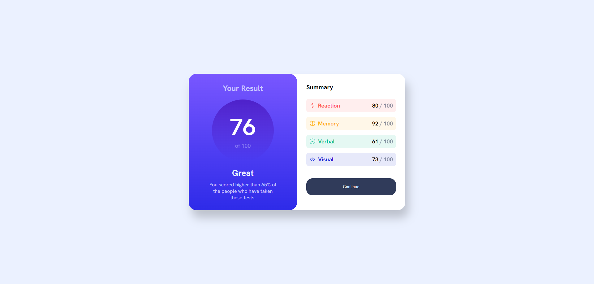

# Results Summary Component

This is a solution to the [Results Summary Component challenge](https://www.frontendmentor.io/challenges/results-summary-component-CE_K6s0maV) on Frontend Mentor.  
Frontend Mentor challenges help you improve your coding skills by building realistic projects.

## 📸 Preview

## 📚 Overview
This project is a responsive results summary card built with **HTML** and **CSS**.  
It displays a score result on the left and a breakdown of different categories on the right.

## ✨ Features
- Responsive design for desktop and mobile.
- Clean and semantic HTML structure.
- CSS variables for easy theme management.
- Flexbox layout for easy alignment.
- Gradient backgrounds using `linear-gradient`.

## 🛠 Built With
- HTML5
- CSS3 (Flexbox, Custom Properties)

## 🚀 Live Demo
[Live Site URL](https://shimanto-codes.github.io/Results-summary-component/)

## 💡 What I Learned
- How to use CSS variables inside gradients.
- Better structuring with Flexbox for side-by-side layouts.
- Using media queries for responsiveness.
